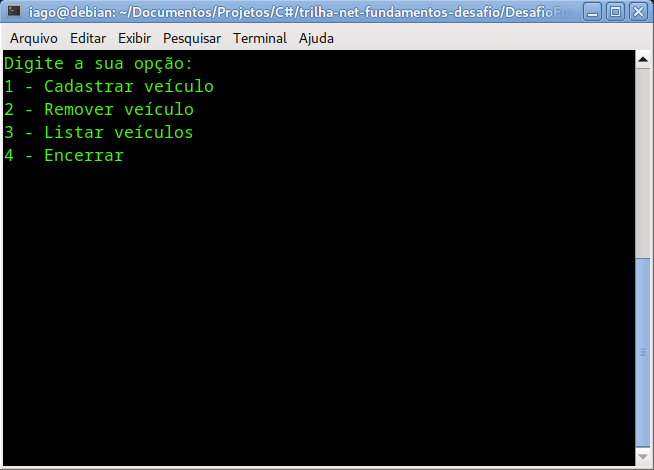

# Sistema de Estacionamento

Este é um projeto simples de um sistema de estacionamento, desenvolvido com fins educacionais. O sistema permite gerenciar veículos estacionados, realizar operações como adicionar e remover veículos, e listar os veículos presentes no estacionamento.



## Funcionalidades

- Adicionar veículo
- Remover veículo (com cálculo do valor cobrado durante o período)
- Listar veículos estacionados
- Encerrar o programa

## Como Usar

### Pré-requisitos

- [Download e instalação do .NET SDK](https://dotnet.microsoft.com/pt-br/download/dotnet-framework)

### Clonar o Repositório

```bash
git clone https://github.com/iago010/trilha-net-fundamentos-desafio.git
